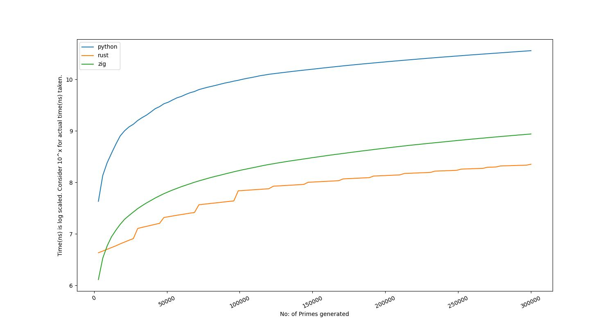

# RUST v/s PYTHON

Benchmark graph that compares speed of Pythona and Rust by generating prime numbers.

Note: The above graph is autogenerated for every github action run. Tweak the parameters in workflow run to get different graph for number of primes.

|Language|nth prime|time taken|
|---|---|---|
|rust|300000|0.924s|
|zig|300000|0.489s|
|python|300000|18.333s|